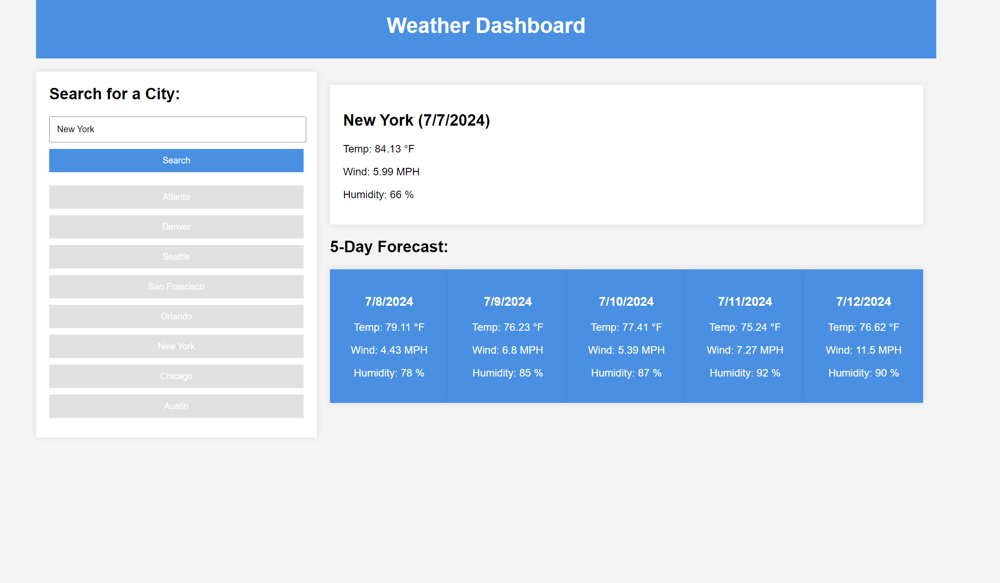

# M6-weather-dashboard

# Description
The Weather Dashboard is a simple web application that allows users to search for the current weather and 5-day forecast for cities worldwide. The application provides detailed weather information including temperature, wind speed, and humidity.

# Features
- Search for current weather and 5-day forecast by city name.
- Quick access buttons for popular cities.
- Displays current weather conditions including temperature, wind speed, and humidity.
- 5-day weather forecast showing temperature, wind speed, and humidity.
- User-friendly interface with a responsive design.

# Link to Deployed Site
https://tylerz3936.github.io/M6-weather-dashboard/

# Screenshot

# Usage
1. Open the Weather Dashboard application.
2. Enter the name of the city you want to search for in the input box and click the "Search" button.
3. Alternatively, you can click one of the predefined city buttons for quick access.
4. The current weather and 5-day forecast for the selected city will be displayed on the right.

# Technologies Used
- HTML
- CSS
- JavaScript
- OpenWeather API
